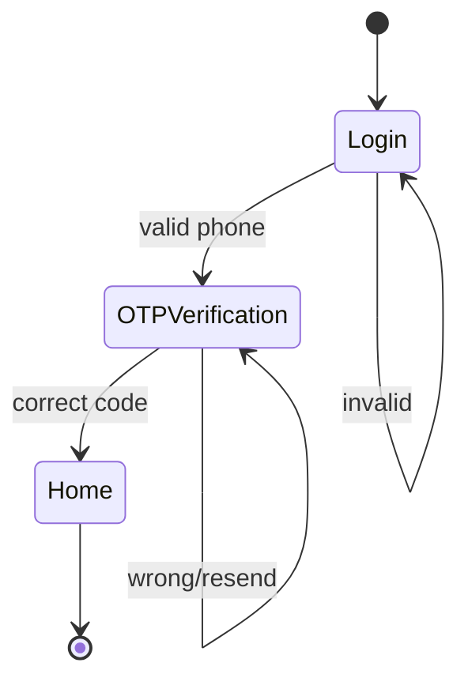

# User Flow Documentation

## Overview

Document user flows at the **decision-point level**: what users decide, not how (UI details). This abstraction makes flows durable across UI changes and focuses on user intent.

- Strongly important, do not assume nothing. If you have doubt, prompt the user in the exact moment.

## Key Concept: Decision Points

| Too Detailed (UI)            | Abstract (Decision)                |
| ---------------------------- | ---------------------------------- |
| "User taps 'Login' button"   | "User initiates authentication"    |
| "User fills phone input"     | "User provides phone number"       |
| "User selects checkbox"      | "User opts in to notifications"    |
| "Modal appears with options" | "User chooses verification method" |

**Why abstract?**

- UI changes frequently, user intent doesn't
- Forces focus on user goals vs. implementation
- Makes flows testable at business level

## Main Workflow

### Phase 1: Flow Context

Ask these questions to establish context:

1. **Flow name**: What is this flow called?
2. **Product**: Which product does this belong to?
3. **Overview**: What is the purpose of this flow? What user goal does it serve?
4. **Entry conditions**: When/how does a user enter this flow?

Example dialogue:

```
"Let's document your flow. What's the flow name and which product does it belong to?"

"What's the main purpose of this flow - what user goal does it achieve?"

"How does a user enter this flow? (e.g., from home screen, after login, via deep link)"
```

### Phase 2: Decision Point Mapping

For each step in the flow, capture:

| Field             | Description                                     |
| ----------------- | ----------------------------------------------- |
| State name        | Where the user is (e.g., "Login", "OTP Verify") |
| User decision     | Abstract action (what they do, not how)         |
| Possible outcomes | Success, error, alternative paths               |
| Next state        | Where each outcome leads                        |

**Mapping Process:**

1. Start from entry point
2. Ask: "What decision does the user make here?"
3. Ask: "What can happen? (success, errors, alternatives)"
4. For each outcome, ask: "Where do they go next?"
5. Repeat until all paths reach terminal states

**Example output table:**

| State            | User Decision         | Outcomes                | Next State       |
| ---------------- | --------------------- | ----------------------- | ---------------- |
| Login            | Provides phone number | Valid → sends SMS       | OTP Verification |
|                  |                       | Invalid → shows error   | Login (retry)    |
| OTP Verification | Enters code           | Correct → authenticates | Home             |
|                  |                       | Wrong → retry           | OTP Verification |
|                  | Requests resend       | Resends SMS             | OTP Verification |

**Tips:**

- Keep state names short (2-3 words)
- Use present tense for decisions ("provides", "selects", "confirms")
- Capture ALL outcomes including errors and edge cases

### Phase 3: Analytics & Communications

For each decision point, define:

#### Analytics

Ask: **"What business question does tracking this answer?"**

| Decision        | Event Name              | Business Question                   |
| --------------- | ----------------------- | ----------------------------------- |
| Provides phone  | `login_phone_submitted` | How many users start login?         |
| Enters OTP      | `otp_verified`          | What's the OTP success rate?        |
| Requests resend | `otp_resend_requested`  | How often do users need OTP resend? |

**Good analytics answer questions like:**

- Where do users drop off?
- What's the conversion rate?
- How long does this step take?
- Which path do most users take?

#### Communications

Ask: **"Should the system send push/email after this decision?"**

| Trigger          | Channel | Purpose                           |
| ---------------- | ------- | --------------------------------- |
| After login fail | Push    | Help user recover (forgot phone?) |
| After OTP expire | Push    | Prompt retry                      |
| After signup     | Email   | Welcome + next steps              |

**Consider:**

- Transactional (must send): confirmations, receipts
- Engagement (optional): nudges, reminders
- Recovery (conditional): error recovery, re-engagement

### Phase 4: Generate Document

1. Build state diagram from decision points (Mermaid syntax)
2. Populate template with collected data
3. Output to `products/{product}/flows/{flow-name}.md`

**State Diagram Rules:**

- Use `[*]` for start/end states
- Arrow labels = outcomes/conditions
- Keep labels short

Example:



## Usage Patterns

### Pattern 1: New Flow Documentation

**User Request:** "Document the login flow for App Gabriel"

**Execution:**

1. Gather context: flow name, product, owner, entry conditions
2. Map each state: Login → OTP → Home
3. Define outcomes for each state
4. Add analytics events for each decision
5. Define comms triggers
6. Generate document with Mermaid diagram

### Pattern 2: Flow Audit

**User Request:** "Review the checkout flow for analytics gaps"

**Execution:**

1. Read existing flow documentation
2. For each decision point, verify:
   - Is there an analytics event?
   - Does the event answer a business question?
3. Identify gaps
4. Propose missing events
5. Update document

### Pattern 3: Flow with Edge Cases

**User Request:** "Document payment flow including all error scenarios"

**Execution:**

1. Map happy path first
2. For each state, ask about errors:
   - What if network fails?
   - What if validation fails?
   - What if user abandons?
3. Add error states to diagram
4. Define recovery analytics
5. Propose error recovery comms

## Best Practices

### Writing Decision Points

**DO:**

- Focus on user intent, not UI
- Use active voice ("User selects", "User confirms")
- Keep it testable ("User provides valid phone")

**DON'T:**

- Describe UI elements ("User taps blue button")
- Mix multiple decisions in one state
- Skip error/alternative paths

### Naming States

**Good:** Login, OTP Verification, Home, Payment, Confirmation
**Bad:** LoginScreen, VerifyOTPPage, step1, verify

### Analytics Events

**Naming convention:** `{domain}_{action}_{result}`

- `login_phone_submitted`
- `otp_verified_success`
- `payment_completed`

**Must track:**

- Flow entry
- Flow completion
- Drop-off points
- Error occurrences

### Mermaid Diagrams

- Keep states to 10-15 max per diagram
- Break complex flows into sub-flows
- Document only the main flow. Exemple: If a login can be followed by the profile completition flow, document only the login flow and define the profile completition as one of the exit flows.
- Label only significant transitions
- Use notes for complex conditions

## Common Scenarios

### Scenario 1: Authentication Flow

States typically include:

- Entry (splash, deep link)
- Identification (phone, email, SSO)
- Verification (OTP, password, biometric)
- Success (home, onboarding)
- Recovery (forgot password, blocked account)

### Scenario 2: Checkout/Payment Flow

States typically include:

- Cart review
- Shipping/delivery selection
- Payment method selection
- Payment confirmation
- Order confirmation
- Error recovery (payment failed)

### Scenario 3: Onboarding Flow

States typically include:

- Welcome
- Profile setup
- Preferences
- Permissions (notifications, location)
- Feature tour
- Completion

## Output Structure

Documents are saved to: `products/{product}/flows/{flow-name}.md`

The template in `references/user-flow-template.md` provides the full structure.

## Resources

### references/

- **user-flow-template.md** - Standard flow documentation template

## Tips

### Before Documenting

1. **Identify scope**: What's the flow boundary? Where does it start/end?
2. **Know the owner**: Who maintains this flow?
3. **Gather context**: Existing docs, analytics, user feedback

### During Documentation

1. **Start with happy path**: Map success first
2. **Then add failures**: What can go wrong at each step?
3. **Validate with owner**: Is this accurate?
4. **Check analytics gaps**: Every decision needs tracking

### After Documentation

1. **Review with engineering**: Is diagram accurate?
2. **Review with analytics**: Are events implementable?
3. **Share with stakeholders**: Does this match expectations?
4. **Keep updated**: Flows change, docs must too
