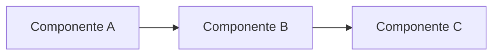

# ERD-P: [Título do Projeto]

> Template ERD — Projeto (ERD-P)
> Arquitetura e decisões de alto nível

**Autor**: [Nome]
**Data**: [YYYY-MM-DD]
**Status**: [Rascunho | Em Review | Aprovado | Em Execução | Concluído]
**Ticket**: LIN-XXX (Project)

---

## 1. Contexto & Problema

- Qual problema estamos resolvendo?
- Por que isso importa agora?
- Link para PRD (se existir): [LIN-XXX]

---

## 2. Objetivos Técnicos (DoD técnico)

> Como saberemos que o projeto cumpriu seu papel? Destaque requisitos técnicos, não apenas funcionais.

- [ ] [Objetivo 1]
- [ ] [Objetivo 2]
- [ ] [Objetivo 3]

---

## 3. Escopo Técnico (Arquitetura)

### Resumo

- Componentes envolvidos e interações de alto nível
- Fluxo de dados (contrato, sequência, volume, criticidade)
- Suposições e restrições

### Diagrama

> Algo simples como Mermaid ou desenhos maiores no Figma.

### Anexos

- [Link para diagrama detalhado]
- [Link para PoC]

---

## 4. Decisões Arquiteturais

> Lista de decisões no formato mini-ADR (Architecture Decision Record)

### Decisão 1: [Título]

| Campo       | Valor                        |
| ----------- | ---------------------------- |
| Decisão     | [O que foi decidido]         |
| Motivação   | [Por que]                    |
| Trade-offs  | [Prós e contras]             |
| Status      | Tomada / Aberta              |
| Data        | [YYYY-MM-DD]                 |
| Responsável | [Nome]                       |

### Decisão 2: [Título]

| Campo       | Valor                        |
| ----------- | ---------------------------- |
| Decisão     | [O que foi decidido]         |
| Motivação   | [Por que]                    |
| Trade-offs  | [Prós e contras]             |
| Status      | Tomada / Aberta              |
| Data        | [YYYY-MM-DD]                 |
| Responsável | [Nome]                       |

---

## 5. Impacto em Outros Times

> Regra: impactos mapeados aqui devem gerar tarefas upstream nos times relevantes.
> Usar template `[Gabriel] Requisição de Suporte entre equipes de Tecnologia`.

| Time Impactado | Natureza do Impacto              | Tarefa Upstream |
| -------------- | -------------------------------- | --------------- |
| [Time X]       | [contrato/evento/storage/infra]  | LIN-XXX         |
| [Time Y]       | [contrato/evento/storage/infra]  | LIN-XXX         |

---

## 6. Riscos & Mitigações

| Tipo          | Risco     | Probabilidade    | Impacto          | Mitigação |
| ------------- | --------- | ---------------- | ---------------- | --------- |
| Técnico       | [Risco 1] | Alta/Média/Baixa | Alto/Médio/Baixo | [Ação]    |
| Organizacional| [Risco 2] | Alta/Média/Baixa | Alto/Médio/Baixo | [Ação]    |
| Estratégico   | [Risco 3] | Alta/Média/Baixa | Alto/Médio/Baixo | [Ação]    |

> Para riscos envolvendo times fora de Tecnologia, garantir comunicação e alinhamento. Criar tarefas para mapear se alinhamentos foram feitos.

---

## 7. Checklist de Prontidão

- [ ] Revisão de arquitetura realizada
- [ ] Times impactados confirmados
- [ ] Diagramas validados
- [ ] Critérios de sucesso revisados
- [ ] Estimável e quebrado em tarefas

> Personalize esse checklist com pontos específicos do seu projeto.
