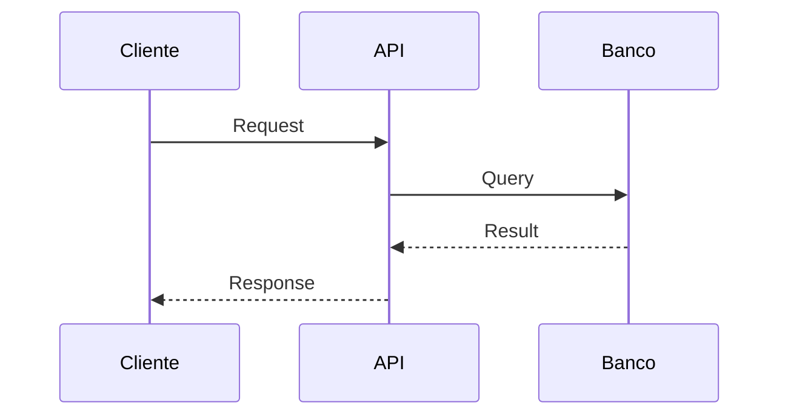

# ERD-T: [Título da Tarefa]

> Template ERD — Tarefa (ERD-T)
> Implementação e detalhes low-level

**Autor**: [Nome]
**Data**: [YYYY-MM-DD]
**Status**: [Rascunho | Em Review | Aprovado | Em Execução | Concluído]
**Ticket**: LIN-XXX (Issue)

---

## 1. Contexto

- Problema específico a ser resolvido (breve)
- Relacionamento com PRD/ERD-P/User Story: [LIN-XXX]

---

## 2. Resultado Esperado

- **Objetivo técnico**: [O que será entregue]
- **Critérios de aceitação**:
  - [ ] [Critério 1]
  - [ ] [Critério 2]
- **Impacto no sistema**: [Como o sistema muda]

---

## 3. Solução Proposta

> **CORAÇÃO DO ERD-T** — Detalhe low-level da implementação

### Sequência de Chamadas



### Contratos (API, eventos, schemas)

```json
// Request
POST /api/v1/exemplo
{
  "campo": "valor"
}

// Response
{
  "id": "uuid",
  "status": "ok"
}
```

### Mudanças de Banco/Storage

```sql
-- Migration
ALTER TABLE exemplo ADD COLUMN novo_campo VARCHAR(255);
```

### Alterações em Permissões/Infraestrutura

- [Descrever mudanças necessárias]

### Estrutura de Código (se aplicável)

```
src/
├── services/
│   └── exemplo-service.ts
├── controllers/
│   └── exemplo-controller.ts
└── repositories/
    └── exemplo-repository.ts
```

---

## 4. Alternativas Consideradas *(opcional)*

### Opção B: [Nome]

- **Prós**: [lista]
- **Contras**: [lista]
- **Por que descartada**: [razão]

### Opção C: [Nome]

- **Prós**: [lista]
- **Contras**: [lista]
- **Por que descartada**: [razão]

---

## 5. Impacto em Outros Times

> Regra: criar tasks upstream imediatamente quando impacto for identificado.
> Usar template `[Gabriel] Requisição de Suporte entre equipes de Tecnologia`.

| Time Impactado | Natureza do Impacto          | Tarefa Upstream |
| -------------- | ---------------------------- | --------------- |
| [Time X]       | [contrato/carga/dependência] | LIN-XXX         |

---

## 6. Riscos / Pontos de Atenção

| Risco                    | Mitigação          |
| ------------------------ | ------------------ |
| [O que pode dar errado]  | [Como evitar]      |
| Débito técnico criado?   | [Tarefa no backlog: LIN-XXX] |

---

## 7. Prontidão para Execução

- [ ] Diagramas validados
- [ ] Contratos finalizados
- [ ] Sem dependências pendentes
- [ ] Tarefa estimável
